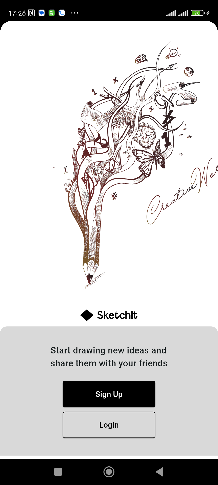

# SketchIt

## Overview
Welcome to SketchIt! SketchIt is a powerful and user-friendly application that serves as a digital sketch pad, allowing users to draw, sketch, and take notes with a variety of tools and features. The app is intuitive, responsive, and provide a rich set of functionalities for artists, designers, and casual users alike.
## Features
- **Drawing Tools:**
- **Brushes and Pens:** Include a variety of brushes, pens, and pencils with adjustable sizes and opacity.
- **Colors:** Provide a color palette with options for custom colors and gradients.
- **Eraser:** Implement an eraser tool with adjustable size.
- **Shapes:** Include basic shape tools such as lines, rectangles, circles, and polygons.
Layers: Allow users to create and manage multiple layers for more complex drawings.
- **User Interface:**
- **Intuitive Controls:** Ensure the interface is easy to navigate with touch gestures and simple menu structures.
- **Toolbar:** Design a customizable toolbar with quick access to frequently used tools.
- **Canvas Management:** Allow users to create, save, and manage multiple canvases.
- **Zoom and Pan:** Implement smooth zooming and panning functionalities for detailed work.
- **Advanced Features:**
- **Undo/Redo:** Provide undo and redo functionalities for editing convenience.
- **Text Tool:** Include a tool for adding and formatting text on the canvas.
- **Export Options:** Allow users to export their sketches in various formats (e.g., PNG, JPEG, PDF).
- **Cloud Sync:** Enable cloud synchronization to save and access sketches across multiple devices.
- **Pressure Sensitivity:** Support pressure-sensitive stylus input for more natural drawing experiences (if applicable).
- **Additional Tools:**
- **Stencils and Templates:** Offer a collection of stencils and templates for users to start with.
- **Custom Brushes: Allow users to create and save custom brushes.
- Guides and Grids: Provide guides and grid overlays for precision drawing.
- **Collaboration Features:**
- **Sharing:** Enable users to share their sketches directly through social media or email.
- **Collaborative Drawing:** Implement real-time collaborative drawing features for users to work together on the same canvas.
## Contributors
1. Damilare Ogunwehin - Team Lead
2. David Ohimai Ohiosimuan
3. Ezeukwu Chukwudumebi
4. Olaleye Nathaniel Oluwatosin
5. Tosin Ezekeil
## Getting Started
To start using SketchIt, follow these simple steps:
### Prerequisites
- Ensure you have a compatible android device

### Download
- [APK DOWNLOAD](https://drive.google.com/file/d/1-0AbTxm3SaHlU1urA2rK7Teb_4YpvpgV/view?usp=drive_link)
### Usage
#### 1. Display of SignUp and Login on Splash Screen and click on Signup to create a new account

#### 2. Fill in all required information for your account

#### 3. Click on Profile Icon to see your profile

#### 4. Create new project with the name of the project

#### 5. Click on any drawing tool to start drawing

### Project Installation
1. **Clone the Repository**:
   ```sh
   git clone https://github.com/Damigrace1/SketchIt
2.  **Navigate to the Project Directory**:
     ```sh
    cd Sketchit
3. **Install Dependencies**:
    ```sh
    flutter pub get
4. **Run the application**:
    ```sh
    flutter run
# License
SketchIt is open-source and available under the MIT License.
Thank you for using SketchIt! Happy Drawing!
